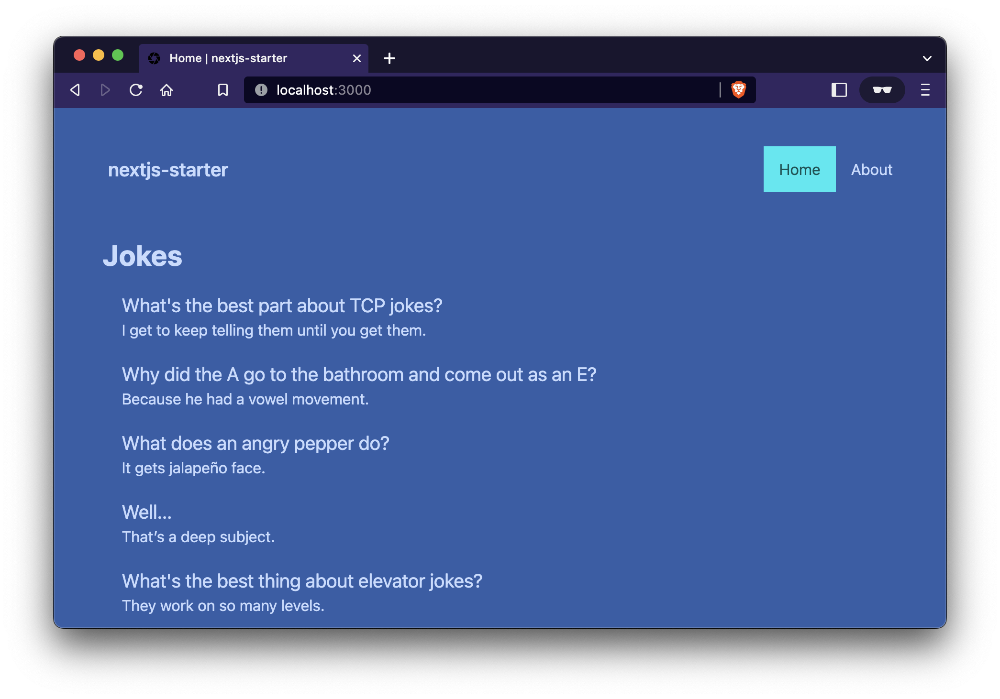

# 도전하는 족제비 (The Challenging Weasel)


Starter template for Next.js, with TypeScript, tailwindcss and daisyUI.



## Features

- **Add Next.js v13 with experimental /app support**
  - Uses experimental `/app` layout in Next.js v13 with server components, client components and layouts.
  - Adds example server-rendered component populated with fetch (using data from jokes API). Display message while loading.
  - Note that `fetch` not usable in client components. Use server components or third-party client-side library like Axios if needed. <https://beta.nextjs.org/docs/data-fetching/fetching>
- Start with minimal [Next.js](https://nextjs.org/) app (using `npm`) via `npx create-next-app nextjs-starter --ts` and simplify content
- Add [tailwindcss](https://tailwindcss.com/) and [daisyUI](https://daisyui.com)
- Add navigation, site layout and two pages
- Add React Testing Library, GitHub action to run tests, README badge, sample test
- Add Prettier config
- Add health check endpoint (`/api/health`)
- Add placeholder `favicon.ico`

## Run locally

```bash
pnpm i
pnpm dev
```

Open [http://localhost:3000](http://localhost:3000) with your browser to see the result.

## Run tests

```bash
pnpm i
pnpm test
```

## DB 관련 세팅

먼저 필요한 프로그램을 설치합니다.

- [supabase cli](https://supabase.com/docs/guides/cli)를 활용합니다. (`brew install supabase`)
- [Docker](https://www.docker.com/)가 설치되어 있어야 합니다. 맥일 경우 공식 홈페이지에서 docker desktop 을 다운로드 받으면 됩니다.

```bash
supabase init # 현재 저장소에서 한 번도 supabase 관련 작업을 한 적이 없을 때. supabse 폴더 생성됨.
supabase login # 자신의 계정으로 로그인합니다.
supabase link --project-ref $SUPABASE_PROJECT_ID --password $SUPABASE_DB_PASSWORD # .env 파일에서 불러옵니다.
```

현재 migrations 를 기반으로 DB 및 스튜디오를 시작합니다. 스튜디오에서 일어나는 모든 변화는 migrations로 기록됩니다.

```bash
supabase start
```

1. 스튜디오에서 DB 스키마 등을 수정.
2. `pnpm sb-diff <filename>` 명령으로 migrations 파일 생성
3. 해당 마이그레이션이 파일로써 잘 존재하는지, 변경사항이 맞는지 체크
4. `pnpm sb-push` 명령으로 변경사항을 스테이징에 적용

그리고 GitHub 로 푸쉬가 성공하기 위해서 아래와 같은 secrets 설정이 필요합니다. 이 설정은 Github Actions 에서 스테이징 서버로 push 하여, 사용자가 실수로 `pnpm sb-push` 를 하지 않는 상황을 방지합니다.

저장소 → Settings → Secrets → Actions → 우측 상단 New repository secret 으로 추가.

- `SUPABASE_ACCESS_TOKEN`
- `SUPABASE_DB_PASSWORD`
- `SUPABASE_PROJECT_ID`

참고로 스테이징이란, 단순히 `SUPABASE_ACCESS_TOKEN` 과 `SUPABASE_PROJECT_ID` 로 연결된 서버를 지칭합니다.

뭔가 명령이 먹히지 않을 때에는 supabase/cli 를 업그레이드 해줍니다.

```sh
brew upgrade supabase
```

## 화면 구성

### 첫 화면

- 닉네임 (닉네임을 정해주세요.)

- 챌린지 만들기
- 챌린지 참여하기

  - 챌린지 만들기
  - (?): 브라우저

- 로그인하기 (로그인 화면으로 이동)

- 완전히 처음 왔을 시 문구 노출: _완전히 처음 오셨나보네요!_

로그인하기 (?)-_로그인을 하면 기록이 더 안전하게 저장됩니다._

- 카카오로 로그인하기 (+ 이전에 로그인 했어요)
- 네이버로 로그인하기
- 구글로 로그인하기
- 로그인 없이 계속하기

## DB 구성

### 챌린지 challenges

- `id`, `created_at`, `updated_at`, `deleted_at`
- `title`: 챌린지 이름
- `desc`: 챌린지 설명
- `public_id`: 초대용 id
- `manager_id`: 관리자 id
- `config` json

### 인증샷 confirmations

- `id`, `created_at`, `updated_at`, `deleted_at`
- `participation_id`: 참여 id
- `images`: [{image_url: string, width: number, height: number, mimetype: string, time: 인증시간}]
- `status`:
  - `pending` 일단 인증을 올린 상태
  - `approved` | `rejected`;
- `date`: 인증 시간. 변경할 수도 있고, 변경못할 수도 있음.
- `title`: 인증 제목
- `desc`: 설명
- `creator_id`: 만든 사람 id

### 참여 participations

- `id`, `created_at`, `updated_at`, `deleted_at`
- `profile_id`: 참여자 id
- `challenge_id`: 챌린지 id
- `status`: string. 대개 관리자가 직접 세팅하도록 하지만 설정에 따라 자동으로 설정할 수도 있음.
  - `in_progress`: 현재 진행 중
  - `success`: 성공했음.
  - `fail`: 실패했음.
  - `abandoned`: 취소됨 / 중간 탈주
  - `ready`: 시작하기 전
  - `waiting_for_approval`: 관리자가 승인해야 함.
- `config`: 기타 설정. 기간 조건 (기본적으로 challenge의 term_condition 을 적용하나, 오버라이딩이 필요할 경우 설정한다.)
- `title`: 인증 제목
- `desc`: 설명

### 사용자 profiles

- `id`, `created_at`, `updated_at`, `deleted_at`
- `auth_id`: 인증된 user id
- `name`: 이름
- `desc`: 자기소개
- `public_id`: 표시용 id

## 챌린지 config

```ts
type ChallengeConfig = {
  version: 1;
  termCondition: TermCondition;
  autoFail: boolean; // 자동으로 fail로 바꾸는지 여부
  autoSuccess: boolean; // 자동으로 success로 바꾸는지 여부
  allowDateChange: boolean; // 인증 날짜를 변경할 수 있는지 여부
  allowImageChange: boolean; // 인증 이미지를 변경할 수 있는지 여부
  allowInappropriateDate: boolean; // 날짜 조건에 맞지 않아도 인증할 수 있는지 여부
  allowExceededconfirmation: boolean; // 현재 조건이 충족해도 추가로 인증할 수 있는지 여부 (기록 남기기 용도..?)
  allowParticipationOngoing: boolean; // 챌린지가 진행 도중에 참여할 수 있는지 여부
};
```

## 챌린지 조건

```ts
type TermCondition =
  | {
      type: 'count';
      start: timestampz;
      // 없을 시 끝나지 않음
      end?: timestampz;
      // 없을 시 반복되지 않음
      repeated?: {
        type: 'day' | 'week' | 'month';
        value: number; // default: 1
      };
      count: number; // default: 1
    }
  | {
      type: 'and' | 'or';
      condition: TermCondition[];
    }
  | {
      type: 'after' | 'before';
      datetime: timestampz;
    };
```
